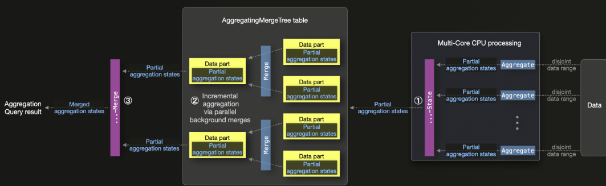

# AggregatingMergeTree

> 작성일: 2026-02-22

- "집계 결과"가 아니라 "집계 상태"를 저장하는 엔진
- 모든 집계가 단순 합산으로 결과를 내기 힘 든 경우 ( Ex. 고유값 집계 )



- 예제

```javascript
/* 여기서 컬럼 타입이 일반 숫자가 아닌 "집계 함수의 상태 타입" */ 
CREATE TABLE agg_live_1m
(
    bucket_dtm DateTime,
    broadcast_id UInt64,
    event_cnt_state AggregateFunction(count),
    user_cnt_state AggregateFunction(uniqExact, String),
    max_buffering_state AggregateFunction(max, UInt32),
    avg_buffering_state AggregateFunction(avg, UInt32)
)
ENGINE = AggregatingMergeTree
PARTITION BY toYYYYMMDD(bucket_dtm)
ORDER BY (bucket_dtm, broadcast_id);

/*
insert할 때는 State 함수 사용
countState()       → count의 중간 상태
uniqExactState()   → 고유값 계산용 중간 상태
avgState()         → 평균 계산용 중간 상태
*/
INSERT INTO agg_live_1m
SELECT
    toStartOfMinute(event_dtm) AS bucket_dtm,
    broadcast_id,
    countState() AS event_cnt_state,
    uniqExactState(user_id) AS user_cnt_state,
    maxState(buffering_ms) AS max_buffering_state,
    avgState(buffering_ms) AS avg_buffering_state
FROM raw_live_event
GROUP BY
    bucket_dtm,
    broadcast_id;
```
