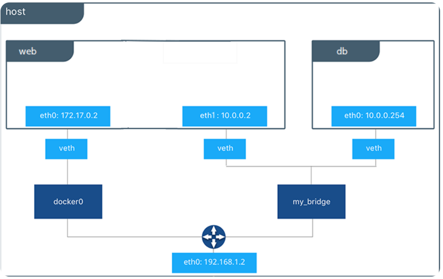

# docker network 요소

> 작성일: 2025-11-07

- veth(virtual ethernet)
	- 가상의 네트워크 인터페이스
	- 각 컨테이너마다 생성되며 자동으로 도커엔진이 생성
- docker network driver
	- 확인 명령어
		- docker network ls
		- docker network inspect bridge
	- bridge : container는 연결된 bridge를 통해 외부와 통신
	- host : 직접 host network 사용

