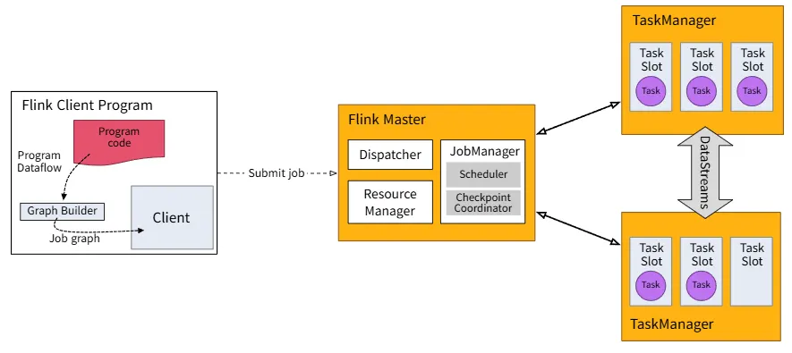

# DataStream API

> 작성일: 2025-10-25

Intro to the DataStream API ( [Intro to the DataStream API](https://nightlies.apache.org/flink/flink-docs-release-2.2/docs/learn-flink/datastream_api/) )

- POJOs : Flink가 **전용 PojoSerializer**로 빠르게 직렬화/역직렬화할 수 있도록 인식하는 "자바 객체"
- 실행 프로세스 : `env.execute()` → 구성된 잡 그래프(Job Graph) 패키징 → Job Mananger 배포되어 병렬 단위로 쪼개짐 → 쪼개진 병렬조각을 Task Manager에서 slot 단위로 실행
- 실행 자원
	- TaskManager = OS 프로세스 (JVM, 여러 쓰레드로 실행 됨)
	- TaskSlot = CPU Core 1개 (권장)
	- Task = OS Thread
		- chain 하나당 thread 하나
		- chain 내부는 직렬



- DataStream 객체
	- "연속적인 레코드 흐름"을 표현하는 **불변의 논리적 스트림**
	- `streamExecutionEnvironment`에서 생성(`fromElements`, `fromSource`, `socketTextStream` 등)되고, `map / flatMap / filter / keyBy / window / process / sink` 같은 연산(operators)을 정의해 **DAG**를 생성

## Fraud Detection 예제

> 작성일: 2025-10-12

```javascript
.addSource();
DataStream<Alert> alerts = transactions
    .keyBy(Transaction::getAccountId)
    .process(new FraudDetector()) # KeyedProcessFunction - 상태값 저장을 위해
    .name("fraud-detector");
.addSink();
env.execute("Fraud Detection");
```
