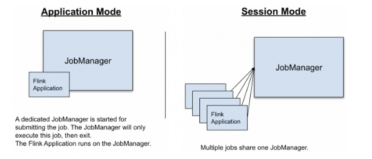

# Deployment Modes

> 작성일: 2026-07-26

- Application Mode
	- 애플리케이션마다 전용 Flink 클러스터 생성
	- main()을 JobManager에서 실행
	- 리소스 / 장애 격리 우수
	- 클러스터를 매번 띄워야 함

```javascript
Application A
 └─ Cluster A
Application B
 └─ Cluster B
```

- Session Mode
	- 클러스터 수명과 Job 수명이 독립적
	- 여러 Job이 하나의 Flink 클러스터를 공유
	- 운영 비용 저렴 / 장애 전파 가능
- Job 제출 방식과 main() 실행 위치가 다르다.


