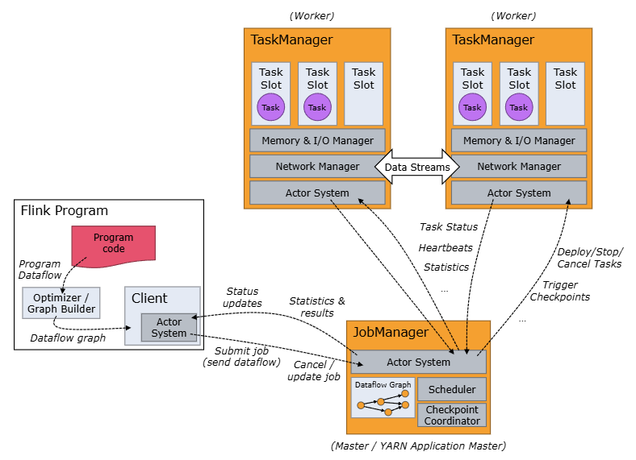
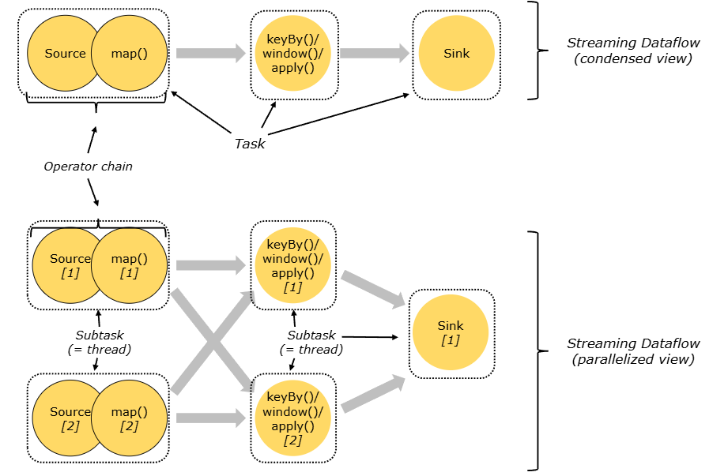
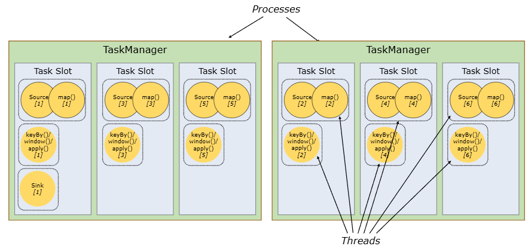

# Flink Architecture

> 작성일: 2026-08-25

## Anatomy of a Flink Cluster

- Client = 잡 제출 담당
- JobManager = 전체 실행 관리/스케줄링 담당
- TaskManager = 실제 작업 실행 담당



## Job Manager

```javascript
JobManager
 ├─ ResourceManager
 │    └─ Task Slot / Resource 관리
 │
 ├─ Dispatcher
 │    ├─ REST API
 │    ├─ Web UI
 │    └─ Job 제출 처리
 │
 └─ JobMaster
      └─ Job1 실행 관리
      └─ Job2 실행 관리 ...
```

## Tasks and Operator Chains

- 서로 연결할 수 있는 Operator들을 Operator Chain으로 묶어 하나의 Task
- Task는 parallelism만큼 Subtask로 나뉘며 각각의 Subtask가 하나의 Thread에서 실행
- `keyBy`처럼 데이터 재분배가 필요한 지점에서는 일반적으로 Chain이 끊김



## Task Slots and Resources

- TaskManager는 하나의 JVM이고, 여러 Task Slot을 만들어 Flink가 병렬 작업의 자원 단위를 관리
- Subtask는 JVM Thread에서 실행되며, Slot은 특히 managed memory를 논리적으로 나누는 역할
- Slot은 CPU core를 물리적으로 격리하지는 않는다. 공통으로 사용


