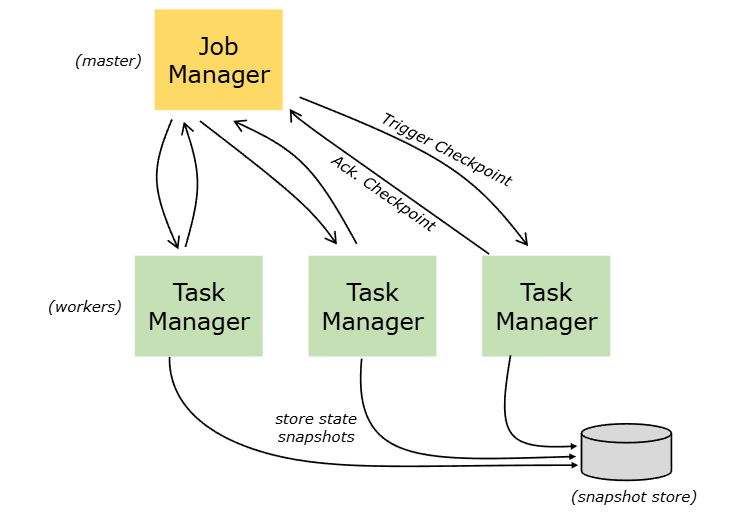
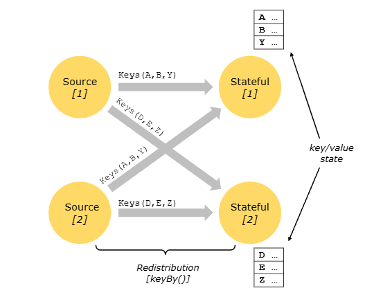

# Stateful Stream Processing

> 작성일: 2026-07-26

## Exactly Once vs. At Least Once

- Checkpoint barrier 정렬을 하면 Exactly Once를 보장하기 쉽지만 지연이 생길 수 있음
- 정렬을 생략하면 지연은 줄지만 장애 복구 시 일부 데이터가 중복 처리되어 At Least Once가 될 수 있음

```javascript
예시)
Stream A: a1, a2, [Barrier 10], a3, a4
Stream B: b1, b2, ......지연........b3, [Barrier 10], b4

[ Alignment를 사용하는 경우 ]
Join Operator는 A 입력의 Barrier 10을 받은 뒤, 
B 입력의 Barrier 10이 올 때까지 A 입력을 잠시 막음

[ Alignment가 지연을 만드는 이유]
B 입력이 느릴 때

[ Alignment를 생략하는 경우 ]
Snapshot[Barrier 10]을 생성하는 시점의 State에는 
이미 a3, a4의 처리 결과도 포함될 수 있음
```

`Exactly Once`로 설정

- flink-conf.yaml
	- Aligned는 데이터를 기다려서 정렬한 뒤 State만 저장
	- Unaligned는 기다리지 않는 대신 정렬되지 않은 버퍼 데이터까지 저장

```javascript
execution.checkpointing.interval: 5 min
execution.checkpointing.mode: EXACTLY_ONCE
 
execution.checkpointing.unaligned.enabled: false

execution.checkpointing.timeout: 10 min
execution.checkpointing.max-concurrent-checkpoints: 1

execution.checkpointing.storage: filesystem
execution.checkpointing.dir: hdfs://namenode:8020/flink/checkpoints
```

- example code

```javascript
public class FlinkJob {
  public static void main(String[] args) throws Exception {
    StreamExecutionEnvironment env =
        StreamExecutionEnvironment.getExecutionEnvironment();

    // 5분마다 Checkpoint
    env.enableCheckpointing(5 * 60 * 1000,CheckpointingMode.EXACTLY_ONCE);

    // 반드시 aligned checkpoint 사용
    env.getCheckpointConfig().disableUnalignedCheckpoints();

    // Checkpoint 하나가 최대 10분 동안 완료되기를 기다림
    env.getCheckpointConfig().setCheckpointTimeout(10 * 60 * 1000);

    // 동시에 하나의 Checkpoint만 수행
    env.getCheckpointConfig().setMaxConcurrentCheckpoints(1);

    // 이전 Checkpoint 완료 후 최소 1분 뒤 다음 Checkpoint 시작
    env.getCheckpointConfig().setMinPauseBetweenCheckpoints(60 * 1000);
```

- 최종 sink까지 중복을 보장 필요

```javascript
KafkaSink<String> sink =
  KafkaSink.<String>builder()
          .setBootstrapServers("broker1:9092")
          .setRecordSerializer(serializer)
          .setDeliveryGuarantee(DeliveryGuarantee.EXACTLY_ONCE)
          .setTransactionalIdPrefix("my-flink-job-")
          .build();
```

## State Backends

- Flink 연산자가 사용하는 상태를 관리하는 저장 방식



```javascript
예시 : 사용자별 누적 시청 시간을 계산
stream
  .keyBy(event -> event.getUserId())
  .process(new ViewingTimeProcessFunction());

JobManager : Checkpoint를 전체적으로 조정
 ├─ Checkpoint 시작 지시
 ├─ 모든 Task의 완료 여부 확인
 ├─ Checkpoint 메타데이터 관리
 └─ Checkpoint 성공 또는 실패 결정
 
TaskManager : 실제 연산을 수행하는 Subtask들이 실행
TaskManager 1
Subtask 0
 ├─ user1 → 120초
 └─ user5 → 80초
TaskManager 2
Subtask 1
 ├─ user2 → 35초
 └─ user6 → 210초
TaskManager 3
Subtask 2
 ├─ user3 → 410초
 └─ user4 → 50초
 
SnapshotStore : Checkpoint 데이터를 영구 저장하는 외부 저장소
```

## Checkpoint

- `Barrier` - Source는 데이터 스트림 중간에 Barrier 추가
- State Backend는 특정 시점의 상태를 스냅샷으로 고정, HDFS, S3 같은 영속 스토리지에 비동기적으로 기록

```javascript
kafka Partition 0
--------
주문 A: user1 +10,000
주문 B: user2 +15,000
주문 C: user1 +20,000
Barrier 42
주문 D: user1 +5,000

>>> 
Barrier 앞의 데이터  → Checkpoint 42에 포함
Barrier 뒤의 데이터  → Checkpoint 42 이후 데이터

>>>
Checkpoint 42에는 이 상태가 저장
Kafka offset:
    partition 0 = 100
    partition 1 = 250

Operator State:
    user1 = 30,000
    user2 = 15,000
```

- `Barrier Alignment` - 입력이 여러 개면 실행 됨

```javascript
Partition 0:
A → B → Barrier 42 │ C, D 대기

Partition 1:
X → Y → Z → Barrier 42
>>>
먼저 Barrier가 도착한 입력 채널을 잠시 막음
그래야 서로 다른 시점의 데이터가 하나의 체크포인트에 섞임
```

## Keyed State

- Key별로 독립적으로 관리되는 상태(State)
	- 그래서 State 업데이트는 모두 각자의 로컬에서 수행
	- 현재 Key의 State만 접근 가능
- Stream과 State는 같은 Key 기준으로 분산
	- 같은 Key는 항상 같은 Subtask로 라우팅

```javascript
keyBy(userId)
>>> user2 가 들어오면 subtask1로 지정이됨
Subtask0 : user1 user5 user9
Subtask1 : user2 user6
```

- Parallelism 변경 시 State도 함께 재분배


