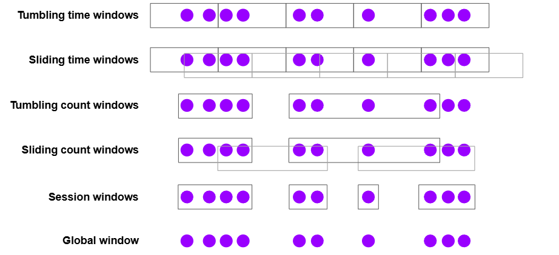

# Windows

> 작성일: 2026-01-26

참조 : [Streaming Analytics](https://nightlies.apache.org/flink/flink-docs-release-2.2/docs/learn-flink/streaming_analytics/)

```javascript
// 가장 기본 패턴
stream
    .keyBy(<key selector>)
    .window(<window assigner>)
    .reduce|aggregate|process(<window function>);
                   ↓
stream
    .keyBy(event -> event.userId)
    .window(TumblingEventTimeWindows.of(Time.minutes(10)))
    .sum("amount");
```

| 방식 | 특징 |
| --- | --- |
| `sum` | 특정 필드 단순 합계 |
| `reduce` | 이벤트가 들어올 때마다 누적 계산 |
| `aggregate` | reduce보다 유연한 누적 집계 |
| `process` | Window 전체 데이터 + Window 메타정보 사용 가능 |

- Assigners
	- Tumbling : 겹쳐지지 않는 고정 크기
	- Sliding : 단위 계


