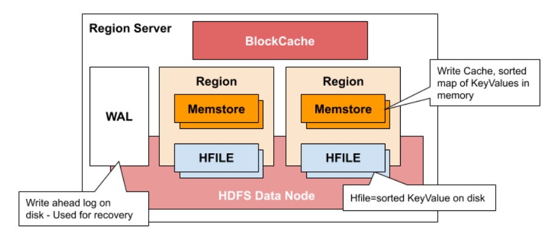

# Scalability

> 작성일: 2025-11-09

- Region에 row크기가 커지면 중간 키를 사용해서 수평 확장을 한다.

## Meta 테이블

- Hbase Catalog 테이블을 유지한다. 주키퍼가 관리한다.

```javascript
[zk: localhost:2181(CONNECTED) 6] ls /hbase
[replication, meta-region-server, rs, splitWAL, backup-masters, table-lock, ....] 
```

## Column Family

- CF는 '물리 저장/정책 단위', 읽기/쓰기 패턴과 보존 정책을 분리해 성능·비용·운영을 동시에 잡음
- CF별로 다르게 압축,인코딩,TTL 등을 지정할 수 있음
- memstore는 key-value 데이터 정렬해서 저장하고, 하나의 CF당 하나의 memstore가 존재
	- 자주 읽는 컬럼과 드물게 쓰는 컬럼을 분리해 캐시/디스크 I/O 간섭을 줄임
	- Region Server Component

## Write 작업

- WAL 기록 → MemStore(메모리) 저장 → Flush → HFile 생성



## Compaction

- minor compaction : 여러 개의 작은 HFile 파일들만 선택적으로 하나의 큰 HFile로 통합
- major compaction : 리전에 있는 모든 HFile들을 모아서 컬럼 당 하나의 HFile을 생성
