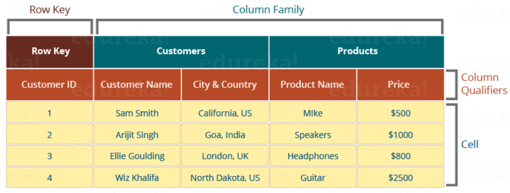

# 테이블 구조

> 작성일: 2025-11-23

- RowKey → ColumnFamily → Column(qualifier) → Value

## 요소 설명

- Table
	- 테이블은 [**Column Oriented 형태**](https://nesoy.github.io/articles/2019-10/Column-Oriented-DBMS)로 저장
- Row
	- 이름순으로 정렬되어 저장된다.
	- Row Key를 디자인 하는 것이 매우 중요 | [**RowKey Design Guide**](https://hbase.apache.org/book.html#rowkey.design)
- Column
	- `Column Family`와 `Column Qualifier`로 구성되어 있고 구분자는 `:`를 사용한다.
- Column Families
	- Disk I/O을 위해 여러 Column들을 물리적으로 가깝게 저장
- Column Qualifiers
	- Data에 추가적으로 Index를 하기 위해 Column Family 추가
	- Column Family가 고정적이더라도 Column Qualifiers는 유동적
- Timestamp
	- value와 함께 같이 저장
	- RegionServer의 데이터가 추가된 시간을 의미
