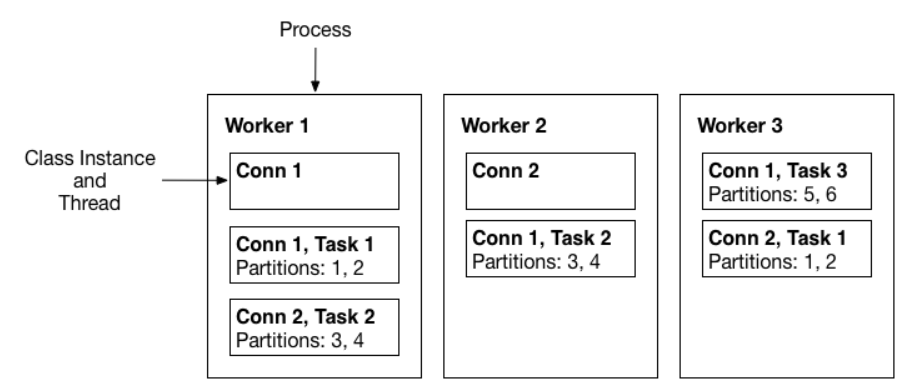

# 구성 요소와 동작

> 작성일: 2025-11-16

Connector / Worker / Tasks

- **Worker**: 프로세스 단위. 커넥터와 태스크를 실행하는 런타임 환경 (JVM 프로세스)
- **Connector:** "이 데이터 파이프라인을 이렇게 구성한다"는 논리 단위. (소스 or 싱크)
- **Task**: Connector가 실제 일을 하기 위해 나눈 실행 단위. 병렬 처리나 부하 분산 단위 (컨슈머역할)

