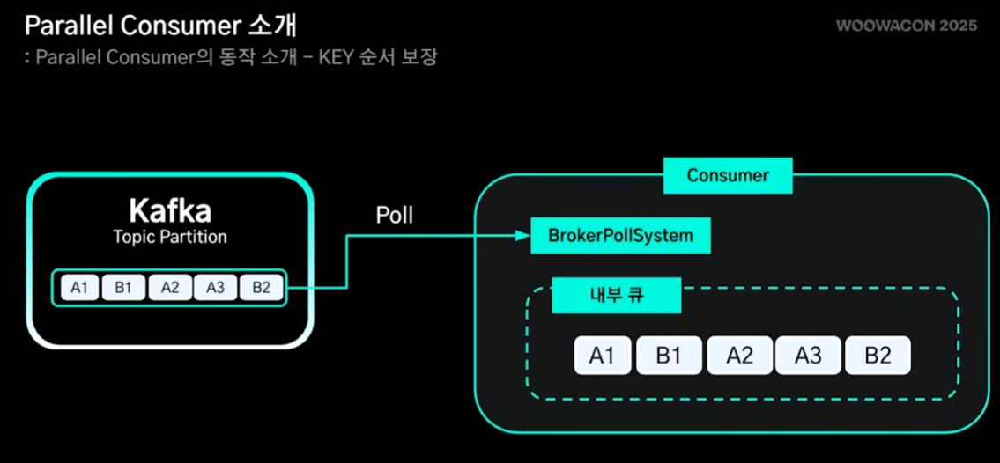
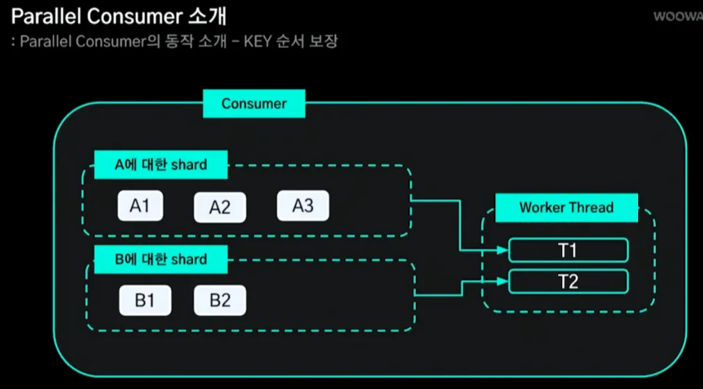

# 파티션 증설없이 병렬처리

> 작성일: 2025-12-20

- vanilla kafka 는 파티션 수의 종속되어 있음 ( vanilla는 파티션 증설이 필요)
- Confluent Parallel Consumer 오픈소스로 단일 소비자가 병렬처리 할 수 있도록 JVM 기반 라이브러리
- Consumer가 가져온 레코드를 내부 Worker Pool에 분배해 **처리 단계의 병렬도**를 높임
- Key를 통해 순서 보장
- Offset commit 은 Offset Map을 통해 동작하여 꼬이지 않음

