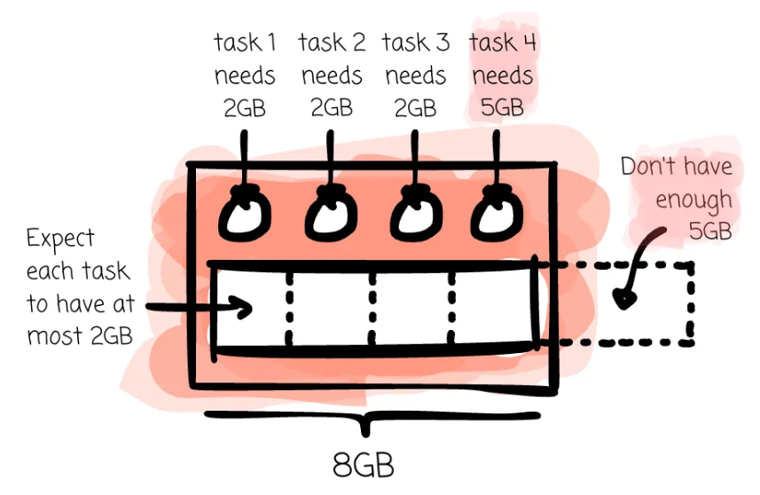

# Spark Executor OOM 원인과 해결

> 작성일: 2026-07-21

## 원인

- Spark Executor에서는 여러 Task가 같은 Executor 메모리를 공유
- 동시에 실행되는 Task가 많거나, Task 하나가 처리하는 Partition이 너무 크면 OOM이 발생

## 해결

- Executor Core 수를 줄여 동시 실행 Task 수를 제한
- Partition 개수를 늘려 Task당 처리 데이터 크기를 줄임 ( Task = Partition )
