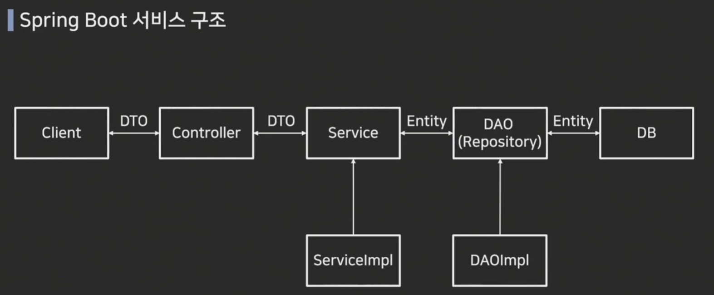

# 데이터 베이스 적용하기

> 작성일: 2025-11-17



```python
# JPA 적용시 심플해짐
[Client] -DTO-> [Controller] -DTO-> [Service] -Entity-> [Repository(JPA)] -Entity-> [DB]
                                  [ServiceImpl]   (구현체 없음, Spring이 Proxy 생성)
```
