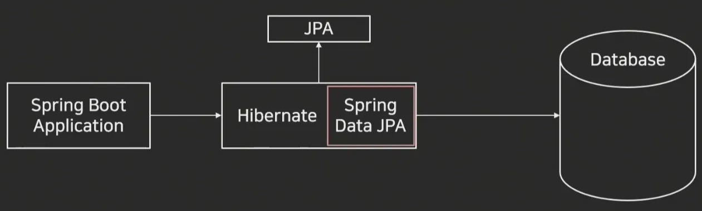

# JPA(Java Persistence API)

> 작성일: 2025-11-17

- ORM 관련 인터페이스 모음
- Spring Data JPA

- @Autowired : 요청에 따라 Bean들 간의 의존 관계를 자동으로 연결
- **IOC**(Inversion of Control) : 객체의 생성, 수명 주기 관리, 의존성 연결에 대한 제어권이 프레임워크(Spring)로 넘김
- **Bean** : IoC 컨테이너에 의해 생성되고 관리되는 자바 객체를 의미
- JpaRepository 상속 (@Repository 생략) : 기본적은 CRUD 사용 가능
